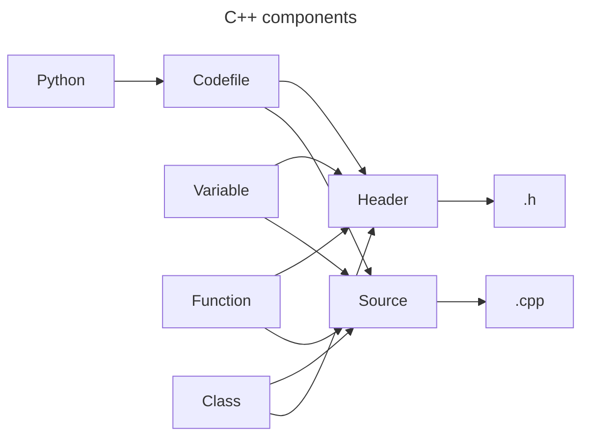

# Developers

- [Developers](#developers)
  - [Design](#design)
    - [C++ Components](#c-components)
  - [Developing](#developing)
    - [Install package locally for developing](#install-package-locally-for-developing)
    - [Update pypi version](#update-pypi-version)
    - [Executing unit tests](#executing-unit-tests)

## Design

### C++ Components



[top](#developers)

## Developing

### Install package locally for developing

```bash
pip uninstall -y erichschroeter.code_generator
python3 -m build
pip install dist/erichschroeter.code_generator-0.1.0-py3-none-any.whl
```

[top](#developers)

### Update pypi version

> [!IMPORTANT]
> Update dependencies, if changed. May require updating the following files:
>  * `pyproject.toml`
>  * `requirements.txt`
>  * `requirements-dev.txt`

```bash
python3 -m build
python3 -m twine upload --repository testpypi dist/*
```

[top](#developers)

[Table]

### Executing unit tests
The following command will execute the unit tests.

```bash
python -m unittest
```

or, using [pytest](https://docs.pytest.org/en/6.2.x/):

```bash
python -m venv .venv
. .venv/bin/activate
pip install -r requirements-dev.txt
python -m pytest
```

[top](#developers)
