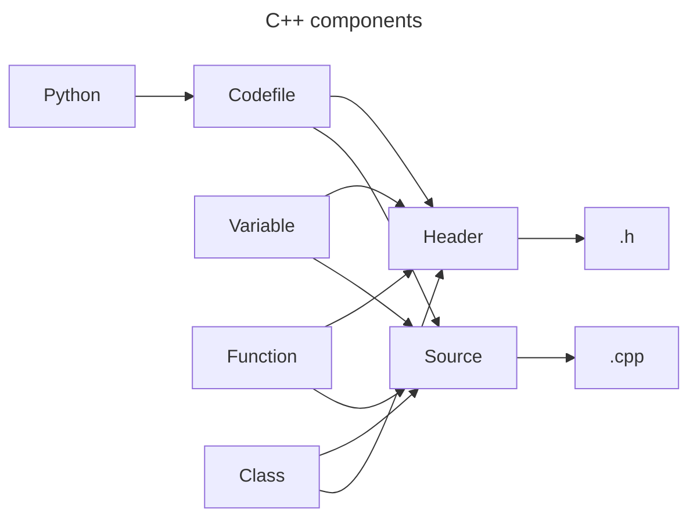

# Developers

## Design

### C++ Components



## Update pypi version

```bash
python3 -m build
python3 -m twine upload --repository testpypi dist/*
```

## Executing unit tests
The following command will execute the unit tests.

```bash
python -m unittest
```

or, using [pytest](https://docs.pytest.org/en/6.2.x/):

```bash
python -m venv .venv
. .venv/bin/activate
pip install -r requirements-dev.txt
python -m pytest
```
